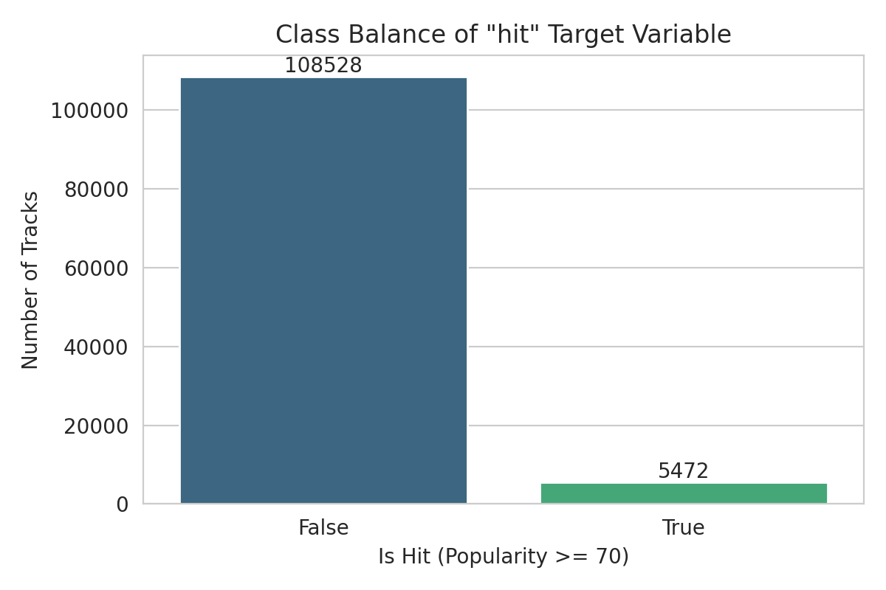
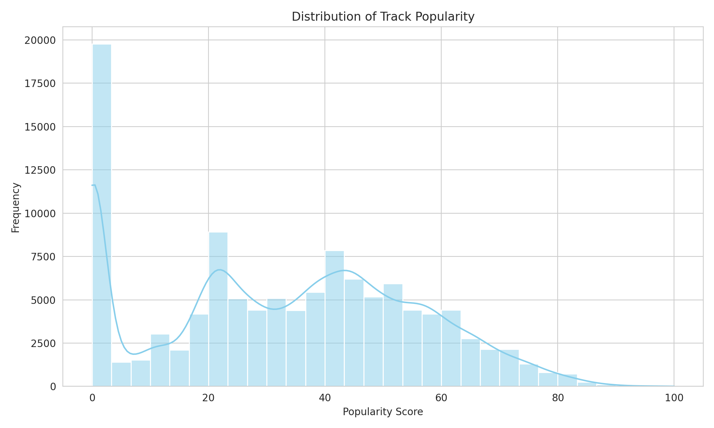
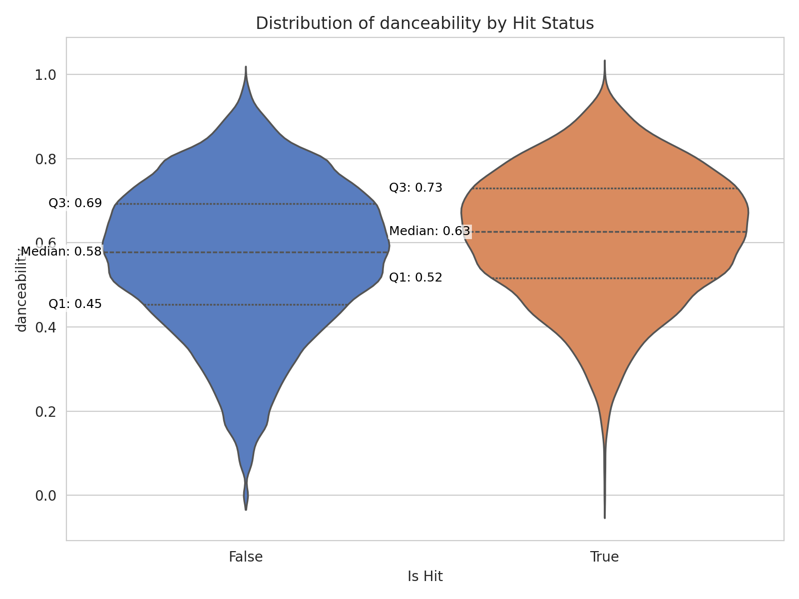
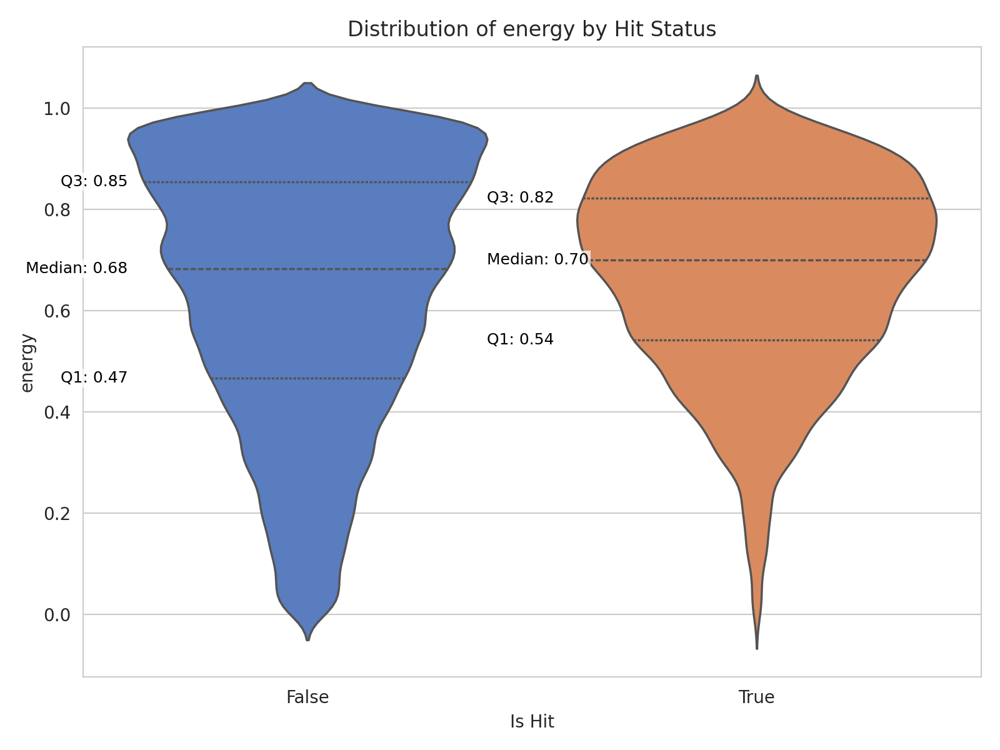
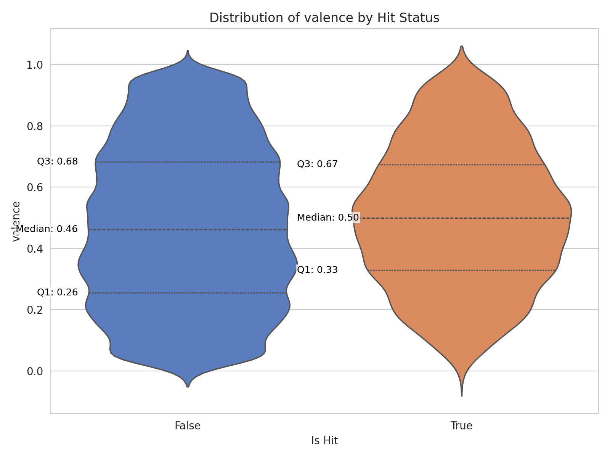
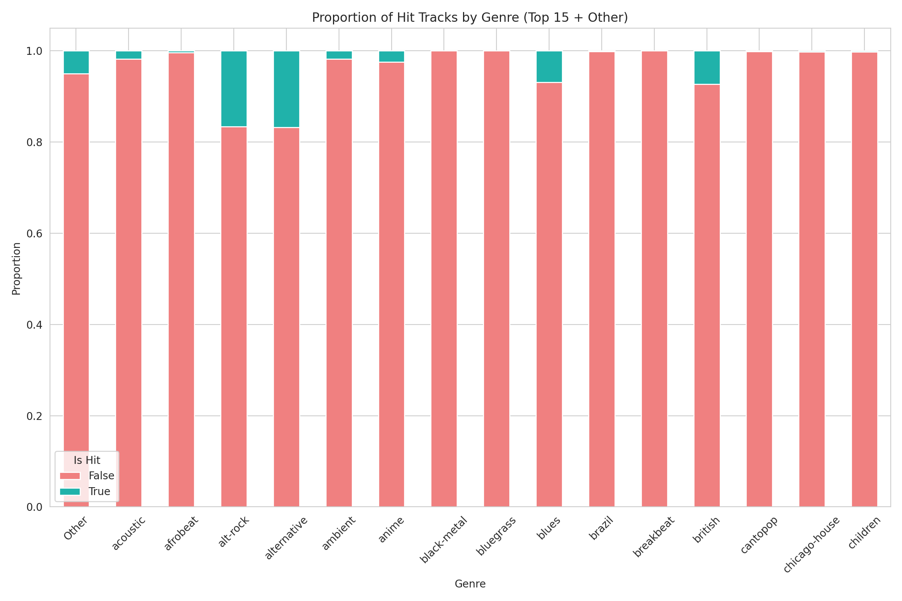
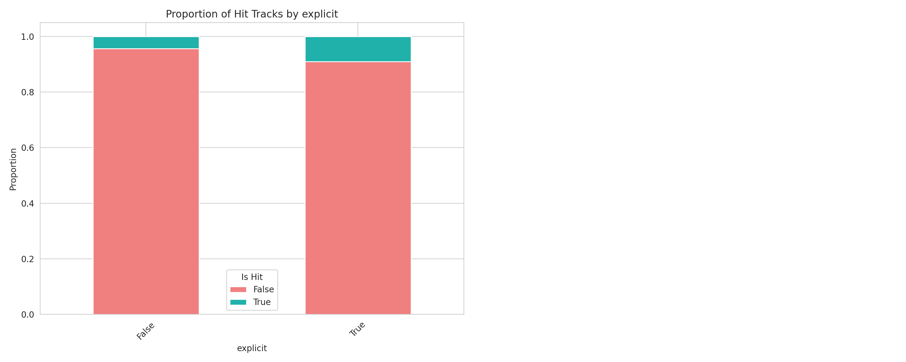
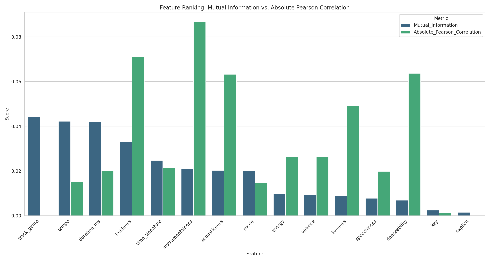
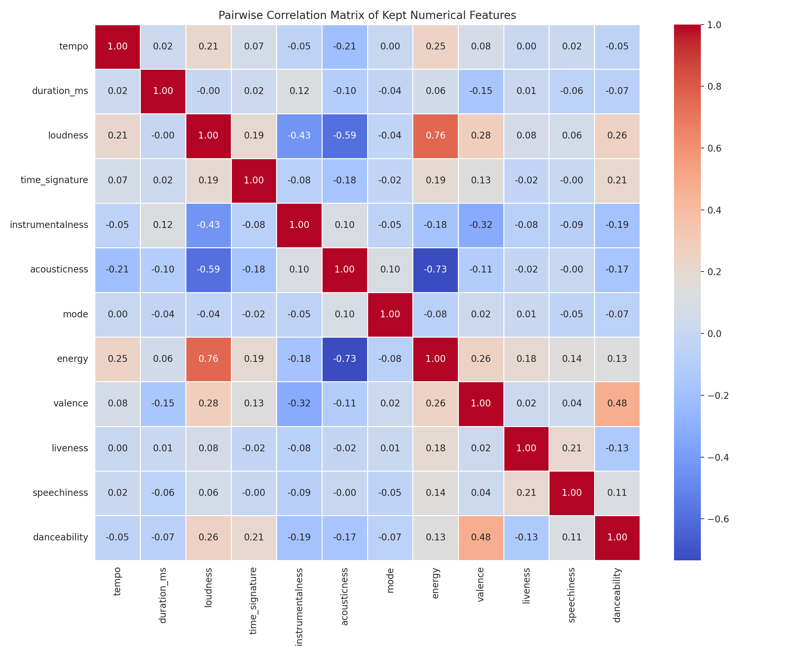

# Predicting Spotify Song Hits Using Machine Learning

## Executive Summary
This project uses Kaggle’s [Spotify Tracks Attributes and Popularity](https://www.kaggle.com/datasets/melissamonfared/spotify-tracks-attributes-and-popularity/data) dataset to test if a supervised machine learning classification model can reliably predict song hits using attributes of the song. Reliability was defined as achieving an F1 score ≥ 0.7. A hit was defined as a popularity score ≥ 70.

I compared six models, to explore model-suitability for the task:
- Logistic Regression (RUS and Weighted)
- Random Forest (RUS and Weighted)
- XGBoost (RUS and Weighted)

**The best-performing model was XGBoost (Weighted) with:**
- **ROC AUC:** 0.87
- **Recall:** 0.81
- **Precision:** 0.14
- **F1 Score:** 0.24
- **Brier Score:** 0.14

The model is excellent at identifying most “hit” songs (high recall) and has a high ROC AUC, meaning it is effective at distinguishing between “hit” and “not hit” tracks. However, it tends to over-predict hits, leading to many false positives (low precision). This approach is suitable for advertising agencies or managers targeting a global audience, because global popularity metrics align with worldwide trends. It is less suitable for national campaigns, as cultural and language differences mean globally popular songs may not be locally popular. Ethically, this limitation should be clearly communicated to manage expectations.

See full code in the `Notebooks/` folder.

---

## Data Infrastructure & Tools
- **Environment:** Google Colab (cloud-based Jupyter notebook)
- **Libraries:** pandas, NumPy, matplotlib, seaborn, scikit-learn, imbalanced-learn, xgboost
- **Data Source:** Kaggle (open dataset)

Colab was chosen for its free, accessible environment and ease of sharing. Python’s ecosystem provided integrated tools for data handling, modeling, and evaluation.

---

## Data Engineering
- Created target variable: `hit = True` if popularity ≥ 70.
- Severe class imbalance (4.8% hits) handled using:
  - **Random Undersampling (RUS)**
  - **Class weights**
- Preprocessing:
  - **Scaling:** StandardScaler for numeric features
  - **Encoding:** OneHotEncoder for categorical features
- Train/test split: 80/20 with stratification.

---

## Data Visualisation & Dashboards

Excluding the “Distribution of Track Popularity” visual, distinct colours were used to enhance accessibility for colour-blind viewers – although the exception visual is still accessible due to the combination of a line and bars, which are distinct, despite their identical colour. Charts are also static and mostly simple to interpret, although guidance is provided in descriptions of violin plots where needed, reducing cognitive load.

Key visuals:
- The bar plot and histogram below visualised severe class imbalance (108528 songs were not hits; 5472 were) and that popularity is skewed towards lower scores, supporting rapid understanding, of the need for imbalance handling, for portfolio viewers.

- Violin plots for hypothesis features. Tracks classified as 'hits' show higher medians in violin plots for energy, danceability and valence, visually ssuggesting they have a significant relationship with the target variable.

- Stacked bar plots for categorical features. The 'alt rock' and 'alternative' genre clearly have a comparatively higher proportion of 'hits'. The 'explicit' content status typically shows less difference in the proportion of 'hits' between 'True' and 'False' categories, suggesting weak relationship with the target variable.

See more in the `Visuals/` folder.

---

## Data Analytics
### Hypotheses:
- **Alternative Hypothesis (H₁):** Danceability, energy, and valence are the main contributors to hit outcome.
- **Null Hypothesis (H₀):** Danceability, energy, and valence are not the main contributors to hit outcome.

### Findings:
There is insufficient evidence to reject the null hypothesis (H₀). Danceability, energy, and valence were not the main contributors to hit outcome. Stronger predictors included track genre, tempo, duration, loudness, acousticness, and instrumentalness.

Feature selection was based on Mutual Information (MI) and Point Biserial Absolute Pearson Correlation (PBAPC). Features with MI > 0.005 or PBAPC > 0.01 were retained.

Multicollinearity was ruled out for numerical features using a Pairwise Correlation Matrix. Future work should explore multicolinearity between categorical features.

### Model Testing:
- Model benchmark table

XGBoost Weighted performed best because its gradient boosting handles complex feature interactions, while class weighting improves balance without losing data, giving the highest ROC AUC and lowest Brier score.
XGBoost and Logistic Regression beat Random Forest because they provide better probability calibration and handle imbalance more effectively, while Random Forest struggled with severe class imbalance and produced poorer AUC and calibration.

**Best Model:** XGBoost (Weighted) – high recall, low precision.

### Limitations:
- Over-predicts hits, leading to many false positives.
- Global popularity may not apply locally.
- Feature selection threshold is too permissive and should be increased, to examine impact (likely beneficial) on model benchmarks.
- Model needs improving before it could hyphothetically be used by marketing agencies. Permission from Kaggle and the dataset owner is also required for the suggested commercial use.

---

## Future Improvements
- Adjust classification threshold to improve precision.
- Hyperparameter tuning for XGBoost.
- Explore cultural context for popularity metrics. Potentially design one model for top 10 coutries based on their total spotify downloads. This would suit each model to their cultures, enabling national marketing campaign support.

  
